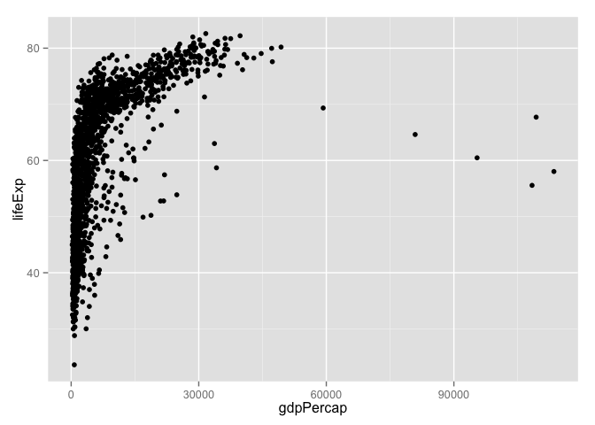

# Class in which we learned about ggplot2

Load the library

```r
library(ggplot2)
```

Load the data. And check out a summary of it so we can know the makeup of it.

```r
library(gapminder)
str(gapminder)
```

```
## 'data.frame':	1704 obs. of  6 variables:
##  $ country  : Factor w/ 142 levels "Afghanistan",..: 1 1 1 1 1 1 1 1 1 1 ...
##  $ continent: Factor w/ 5 levels "Africa","Americas",..: 3 3 3 3 3 3 3 3 3 3 ...
##  $ year     : num  1952 1957 1962 1967 1972 ...
##  $ lifeExp  : num  28.8 30.3 32 34 36.1 ...
##  $ pop      : num  8425333 9240934 10267083 11537966 13079460 ...
##  $ gdpPercap: num  779 821 853 836 740 ...
```

## Let's make some plots...

Assigning the plot to an object. aes is the aesthetic mapping. this one specifies it's a scatterplot and the x and y.

```r
p <- ggplot(gapminder, aes(x=gdpPercap, y=lifeExp))
```

Shows the points, geom_line() would fit a line.

```r
p + geom_point()
```

 

